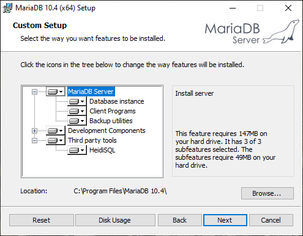
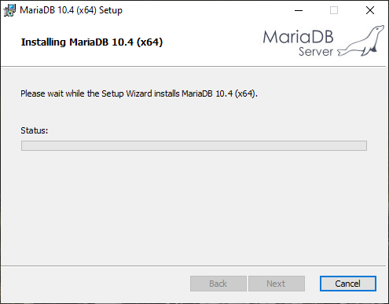
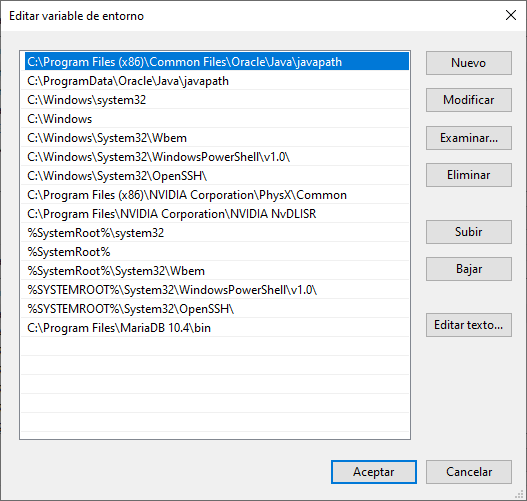
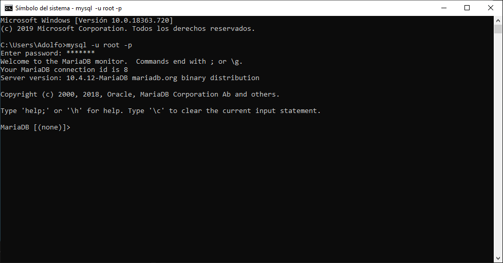

Iniciamos el asistente de instalación de MraiaDB y marcamos los campos por defecto.

Comenzamos la instalación.

Añadimos la carpeta bin de MraiaDB a las variables de entorno.

Iniciamos MariaDB
